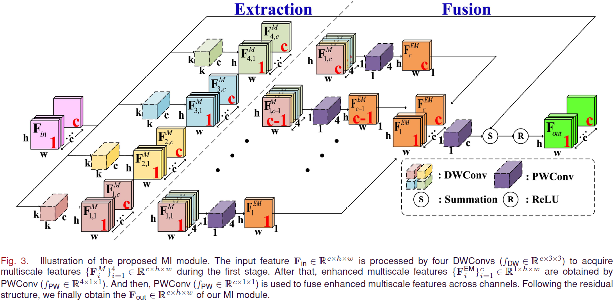
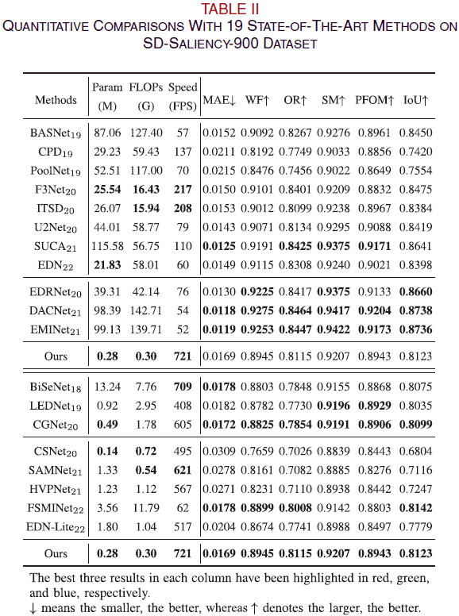
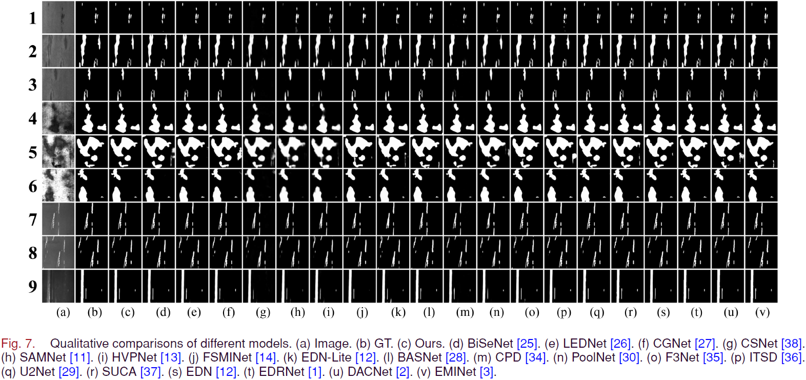

# MINet (TII 2024)
MINet: Multiscale Interactive Network for Real-Time Salient Object Detection of Strip Steel Surface Defects, [Kunye Shen](https://scholar.google.com.hk/citations?user=q6_PkywAAAAJ&hl=zh-CN)， [Xiaofei Zhou](https://scholar.google.com.hk/citations?user=2PUAFW8AAAAJ&hl=zh-CN)，and [Zhi Liu](https://scholar.google.com.hk/citations?user=Sd5VB2cAAAAJ&hl=zh-CN).

## Required libraries
numpy 1.18.1  
Python 3.7   
PyTorch 1.4.0  
torchvision 0.5.0  

## Usage
1. Clone this repo
```
https://github.com/Kunye-Shen/MINet.git
```
2. We also provide the predicted saliency maps ([GoogleDrive](https://drive.google.com/drive/folders/1cj_Gd8EDIPvP4SpCdNWhS4G-fRMxm7VC?usp=drive_link) or [baidu](https://pan.baidu.com/s/1eBZX_1Nf_sWYVz2opp4f0A) extraction code: rokb.).

## MI Module


## Quantitative Comparison


## Qualitative Comparison
